# TokenLocal ERC-20 & Staking DApp


TokenLocal is a local-first Web3 learning project for the full smart-contract workflow: write Solidity, compile, test, deploy to a private Hardhat chain, and interact through a React dApp with a browser wallet.

It includes an ERC-20 token with owner-controlled minting, an experimental TKL staking pool with time-based rewards, a Hardhat/TypeScript toolchain, and a React + ethers v6 interface.



> Important: this is an educational local-development project. It has no audit, public-network configuration, production access control, monitoring, or operational safeguards. Do not deploy it unchanged to a public network or use it with real assets.

## Status

| Area | Current implementation |
| --- | --- |
| Blockchain runtime | Local Hardhat JSON-RPC node at `127.0.0.1:8545` |
| Expected chain ID | `31337` |
| Token | OpenZeppelin ERC-20 named `Token Local` (`TKL`) |
| Token decimals | 18 |
| Initial local supply | 1,000,000 TKL to deployer |
| Token minting | Unlimited and restricted to token owner |
| Staking rewards | TKL per second using reward-per-token accounting |
| Contract test runner | Hardhat + Chai |
| Frontend | React 19, Create React App, ethers v6 |
| Persistence | Hardhat node memory; reset when its process resets |

## Features

- ERC-20 transfer, allowance, and `transferFrom` behavior inherited from OpenZeppelin.
- Owner-only TKL minting.
- Staking flow: approve → stake → withdraw → claim rewards.
- Global reward-rate configuration and pool reward funding by staking owner.
- React wallet connection restricted to the local Hardhat chain.
- Token metadata, balance, transfer, and owner mint UI.
- Staking balance, allowance, pending reward, approval, stake, withdraw, and claim UI.
- ABI/address metadata handoff from deployment tooling to the frontend.

## Quick start


Prerequisites:

- Node.js LTS and npm
- MetaMask or another EIP-1193-compatible browser wallet
- A terminal capable of running three local processes

Install dependencies in both applications:

```bash
# repository root: Hardhat contracts and tests
npm ci

# frontend: React application
cd my-local-token-ui
npm ci
cd ..
```

Verify the repository:

```bash
npx hardhat compile
npx hardhat test
npx tsc --noEmit
(cd my-local-token-ui && CI=true npm run build)
```

Run the local stack:

```bash
# terminal one
npm run node

# terminal two
npm run deploy:local

# terminal three
cd my-local-token-ui && npm start
```

Open `http://localhost:3000`. Configure MetaMask with RPC URL `http://127.0.0.1:8545`, chain ID `31337`, and one development account printed by `npm run node`.

## Commands

| Command | Purpose |
| --- | --- |
| `npm run node` | Start the local Hardhat chain. |
| `npx hardhat compile` | Compile Solidity and generate TypeChain definitions. |
| `npx hardhat test` | Run the Hardhat/Chai contract suite. |
| `npx tsc --noEmit` | Type-check Hardhat TypeScript scripts and tests. |
| `npm run deploy:local` | Deploy both contracts to `localhost` and export ABI/address metadata. |
| `cd my-local-token-ui && npm start` | Start the React development server. |
| `cd my-local-token-ui && CI=true npm run build` | Create an optimized static frontend build. |

## Repository map

```text
contracts/
├── TokenLocal.sol             ERC-20 token and owner-only minting
└── StakingContract.sol        TKL staking and reward accounting

scripts/
└── deployTokenLocal.ts        Deploys both contracts; writes frontend metadata

test/
└── TokenTest.ts               TokenLocal contract tests

my-local-token-ui/
└── src/
    ├── App.js                 wallet connection, token reads, transfer, mint
    ├── StakeComponent.js      approve, stake, withdraw, claim flow
    ├── Navbar.js              local application navigation and wallet controls
    └── contract-info.json     deployed contract addresses and ABIs

docs/
├── ARCHITECTURE.md            System boundaries, runtime, and component flow
├── DOMAIN-MODEL.md            On-chain entities, reward math, and invariants
├── DEVELOPMENT.md             Setup, tests, smoke checks, and contribution flow
├── DEPLOYMENT.md              Local deployment and wallet instructions
├── SECURITY.md                Trust model, risks, and production checklist
└── SMART-CONTRACTS.md         Contract-level API and state reference
```

## Core user flows

### Token transfer

1. Start the local chain and deploy fresh contracts.
2. Import a funded Hardhat development account into MetaMask.
3. Connect the wallet in the dApp.
4. Read TKL token metadata and the active account balance.
5. Submit a valid recipient address and display-unit amount.
6. Confirm the MetaMask transaction and wait for chain confirmation.

### Staking

1. The staking owner funds reward liquidity by approving TKL and calling `depositRewardTokens`.
2. A user enters an amount and approves the staking contract for that amount.
3. The user stakes, which transfers approved TKL into the pool.
4. Reward accrues according to stake share, elapsed time, and the global rate.
5. The user can claim reward and withdraw principal subject to pool liquidity and contract state.


The pool uses TKL for both staked principal and reward payment. Funding and owner withdrawal must therefore be managed carefully. See [Security notes](docs/SECURITY.md).

## Documentation

- [Architecture](docs/ARCHITECTURE.md)
- [Domain model and invariants](docs/DOMAIN-MODEL.md)
- [Development and verification guide](docs/DEVELOPMENT.md)
- [Local deployment guide](docs/DEPLOYMENT.md)
- [Smart-contract reference](docs/SMART-CONTRACTS.md)
- [Security and operational notes](docs/SECURITY.md)

## Known limitations

- Local Hardhat state is ephemeral; restarting the node invalidates old deployment addresses and balances.
- The current deploy script has a frontend metadata output-path issue that must be corrected before automated frontend synchronization. See [Development guide](docs/DEVELOPMENT.md#deployment-metadata-handoff).
- Existing automated tests cover `TokenLocal`, not the full staking lifecycle.
- `StakingContract` reward accounting can accrue claims without proving pool solvency.
- `withdrawExcessReward` lacks reserve enforcement and can endanger principal/reward liquidity if misused.
- Token minting has no cap and relies entirely on token-owner trust.
- The frontend assumes a local network and an 18-decimal token; it is not a generic production wallet client.
- No license file is currently included. Do not assume reuse or redistribution rights until one is added.

## Verification status

At the documented repository state:

- `npx hardhat compile` completes successfully.
- `npx hardhat test` reports 8 passing TokenLocal tests.
- `npx tsc --noEmit` completes successfully.
- `CI=true npm run build` completes successfully in `my-local-token-ui/`.

These checks establish only that the tested local code paths build and pass their existing tests. They do not provide an audit, public-deployment approval, or guarantee of staking-pool solvency.
