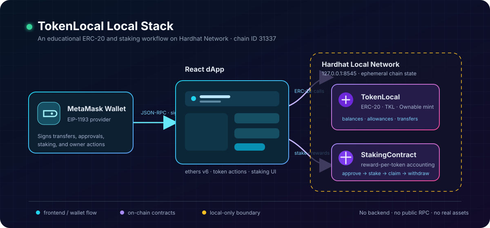

# Architecture

## System scope

TokenLocal runs entirely as a local development stack:

```text
MetaMask / EIP-1193 wallet
          |
          v
React dApp (my-local-token-ui, ethers v6)
          |
          v
Hardhat JSON-RPC node (127.0.0.1:8545, chain ID 31337)
          |
          +--> TokenLocal ERC-20
          |
          +--> StakingContract
```



There is no backend service, database, indexer, hosted RPC provider, or public-network configuration in the repository. The wallet signs every state-changing operation and the Hardhat node owns all chain state for the current local session.

## Repository layout

```text
.
├── contracts/
│   ├── TokenLocal.sol          ERC-20 token and mint authorization
│   └── StakingContract.sol     staking ledger and reward accounting
├── scripts/
│   └── deployTokenLocal.ts     deploys both contracts and exports ABI/address data
├── test/
│   └── TokenTest.ts            TokenLocal contract tests
├── hardhat.config.ts           compiler and Hardhat plugin configuration
└── my-local-token-ui/
    ├── src/App.js              wallet lifecycle, token reads, transfer/mint screens
    ├── src/StakeComponent.js   approval, stake, withdrawal, and reward-claim UI
    ├── src/Navbar.js           in-app view navigation and wallet menu
    └── src/contract-info.json  address/ABI metadata consumed by the UI
```

## Contract layer

### TokenLocal

`TokenLocal` inherits OpenZeppelin `ERC20` and `Ownable`.

- The constructor accepts the name, symbol, and base-unit initial supply.
- The full initial supply is minted to the deployer.
- The deployer is the initial owner.
- Only the owner can invoke `mint(address,uint256)`.
- Standard ERC-20 behavior (`transfer`, `approve`, `allowance`, `transferFrom`, `balanceOf`) is inherited from OpenZeppelin.

The deployment script initializes the token as `Token Local` (`TKL`) with `1,000,000` display units and 18 decimals.

### StakingContract

`StakingContract` takes the TKL contract address at construction and uses that same ERC-20 both for stake principal and rewards. It tracks total stake, each user’s stake, global reward accumulation, each user’s accounted reward index, and accrued-but-unclaimed rewards.

User paths:

1. Call `TokenLocal.approve(stakingAddress, amount)`.
2. Call `stake(amount)`, which transfers the approved tokens into the pool.
3. Call `withdraw(amount)` to return principal. This does not claim rewards; accrued reward stays claimable afterwards.
4. Call `claimReward()` to transfer accrued rewards from the reserved budget.

Owner paths:

- `notifyRewardAmount(amount, duration)` transfers a reward budget in and starts a period. Rejected while a period is still running.
- `withdrawExcessReward(amount)` transfers free balance to the owner, bounded by `freeBalance()` so stake principal and the unpaid reward budget are unreachable.
- `transferOwnership(newOwner)` then `acceptOwnership()` move administration in two steps. `renounceOwnership()` always reverts.

For exact state and accounting details, read [Smart-contract reference](SMART-CONTRACTS.md) and [Security notes](SECURITY.md).

## Frontend data flow

`App.js` imports `contract-info.json` and, after a wallet connection, constructs ethers v6 `Contract` instances with the signer. The active account and contract instances drive token balance, metadata, transfer, and owner minting screens.

`StakeComponent.js` receives the signer, account, token contract, staking contract, and token symbol from `App.js`. It reads allowance, wallet balance, stake balance, and pending reward, then submits signed approval, staking, withdrawal, and claim transactions.

`contract-info.json` is generated deployment metadata. Its addresses are only valid for the specific chain state where deployment occurred. Restarting a non-persistent Hardhat node resets its state and invalidates prior addresses; redeploy and refresh this file before reconnecting the UI.

## Deployment metadata handoff

The deploy script obtains ABIs from Hardhat artifacts and writes both ABI/address pairs to `my-local-token-ui/src/contract-info.json`. This creates the link between compiled contracts and the React application without hardcoding addresses in source code.

The current `frontendSrcPath` expression uses `../../my-local-token-ui/src` relative to `scripts/`, which resolves outside this repository. Correct it before using deployment automation. The intended target is `<repository-root>/my-local-token-ui/src`.

## Design boundaries

- Local only: Hardhat’s local accounts, state, and contract addresses are development artifacts, not production credentials or deployments.
- Browser wallet: MetaMask handles account access and signatures; the UI must not handle private keys.
- Single-token pool: `stakingToken` and `rewardToken` intentionally point to the same TKL contract.
- No upgrade pattern: neither contract uses proxy storage or an upgrade authorization mechanism.
- No price, bridge, or off-chain service: navigation labels or UI placeholders do not create those capabilities.
