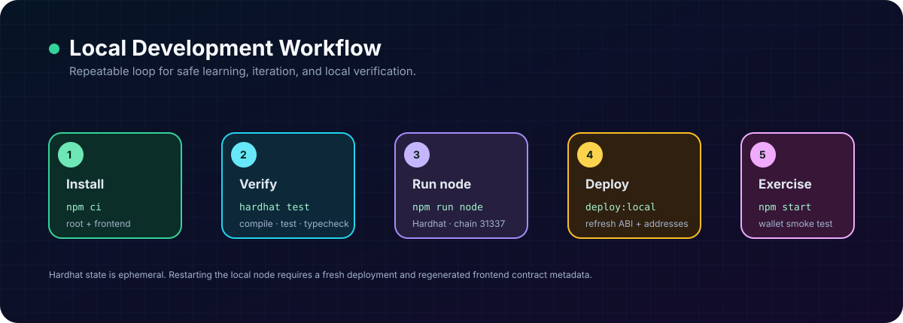

# Development and Verification Guide

## Environment

TokenLocal has two independent Node.js applications:

| Directory | Role | Lockfile |
| --- | --- | --- |
| repository root | Hardhat contracts, TypeScript scripts, tests | `package-lock.json` |
| `my-local-token-ui/` | React / Create React App frontend | `my-local-token-ui/package-lock.json` |

Use a current Node.js LTS release and npm. Install each dependency set from its own directory:

```bash
# Smart contracts and Hardhat tooling
npm ci

# React dApp
cd my-local-token-ui
npm ci
```

Use `npm ci` for a clean reproducible install. If a dependency is intentionally changed, update `package.json` and its matching lockfile together.

### Hardhat is pinned to 2.x

`hardhat` is held at `^2.x` because `@nomicfoundation/hardhat-toolbox@5` targets Hardhat 2. Hardhat 3 requires an ESM project (`"type": "module"`), a different config format, a different toolbox package, and a different way of obtaining `ethers` inside tests. Installing it here makes the toolchain refuse to run at all.

Migrating is worthwhile later, mainly for Hardhat 3's Solidity fuzz and invariant tests, which would cover the gap noted under [Recommended staking-test plan](#recommended-staking-test-plan) far better than a hand-written randomized loop. Do it as its own change, driven by that need rather than by the version number.

## Run locally



The local stack needs three processes.

Terminal one — start Hardhat’s persistent local chain:

```bash
npm run node
```

Terminal two — deploy the contracts once the node is ready:

```bash
npm run deploy:local
```

Terminal three — run the React frontend:

```bash
cd my-local-token-ui
npm start
```

Open `http://localhost:3000`. MetaMask must point to `http://127.0.0.1:8545` with chain ID `31337` and use an account imported from the active Hardhat node output.

## Quality gates

Run the following before merging a contract, deploy-script, or UI behavior change:

```bash
# repository root
npx hardhat compile
npx hardhat test
npx tsc --noEmit

# frontend
cd my-local-token-ui
CI=true npm run build
```

Expected results at the documented repository state:

- Hardhat compiles Solidity and generates TypeChain types without diagnostics.
- Hardhat/Chai completes the `TokenLocal` suite.
- TypeScript completes without diagnostics.
- Create React App completes an optimized production build.

The frontend dependency tree may report deprecated transitive packages and audit findings during installation. Treat these as maintenance work to review; do not resolve them blindly with forced upgrades in a smart-contract project.

## Current automated coverage

`test/TokenTest.ts` uses Hardhat, Chai, and fixtures to verify `TokenLocal` behavior.

| Area | Covered behavior |
| --- | --- |
| Deployment | Name, symbol, decimals, total supply, deployer balance, initial owner. |
| Transfers | Transfers between accounts and standard `Transfer` events. |
| Insufficient balance | OpenZeppelin custom-error reverts. |
| Allowance | Approval and `Approval` event. |
| Mint control | Owner can mint; non-owner reverts. |

`StakingContract` is covered by four files, 23 tests in total:

| File | Covered behavior |
| --- | --- |
| `test/StakingContract.ts` | Owner cannot reach stake principal; contract balance never drops below `totalStaked`; a staker can always recover principal. |
| `test/StakingRewardPeriod.ts` | Accrual stops at `periodFinish`; overlapping periods rejected; staker-free intervals are not awarded to whoever stakes next; proportional split; invalid amount and duration; flooring of the rate. |
| `test/StakingReserve.ts` | Reserve rises on funding and falls on payment; budget released only for genuinely staker-free time; free-balance identity; direct donations remain withdrawable. |
| `test/StakingOwnership.ts` | Renouncing reverts; two-step transfer requires acceptance; a mistyped address does not orphan the contract. |

Not yet covered automatically:

- invariant and fuzz testing: the suite checks known scenarios, it does not search for unknown ones;
- adversarial token behavior (reentrant, fee-on-transfer, rebasing), which the contract documents as unsupported rather than defends against;
- frontend component behavior or browser-wallet flows;
- deployment-script output path and metadata handoff;
- any public testnet run.

A passing suite is not a security audit.

## Manual smoke test

Use only accounts printed by the current local Hardhat node. Do not test with real private keys or a wallet that holds value.

### Contract deployment and metadata

1. Start a fresh Hardhat node.
2. Correct the `frontendSrcPath` issue described below before running deployment automation.
3. Deploy TokenLocal and StakingContract to `localhost`.
4. Confirm `my-local-token-ui/src/contract-info.json` contains fresh address and ABI entries for `tokenLocal` and `stakingContract`.
5. Confirm each address has deployed bytecode using Hardhat console or an ethers provider.

### Token flow

1. Import the deployer and a second local account into MetaMask.
2. Connect the deployer to the dApp and verify name, symbol, decimals, supply, and wallet balance.
3. Transfer a small amount of TKL to the second account.
4. Switch MetaMask to the second account and verify the displayed balance.
5. As token owner, mint a small amount to the second account and confirm total supply increases.
6. As the second account, attempt to mint and confirm the transaction reverts.

### Staking flow

1. As owner, approve the staking contract and call `notifyRewardAmount(amount, duration)` to fund and start a reward period. Before this, `rewardRate` is zero and no reward accrues.
2. As a user, enter a small stake amount and approve the pool.
3. Wait for approval confirmation, then stake.
4. Confirm wallet TKL decreases and the displayed stake increases.
5. Wait for local blocks/time to advance, refresh data, and confirm a pending reward is reported.
6. Claim reward and confirm wallet balance changes.
7. Withdraw a partial amount, then the remaining stake, and confirm principal is returned.
8. Try a withdrawal exceeding the user stake and confirm it fails.

### Network reset behavior

1. Stop and restart `npx hardhat node`.
2. Confirm previously deployed contract addresses no longer represent the current chain state.
3. Redeploy and regenerate `contract-info.json`.
4. Reload/reconnect the frontend and repeat a small token read.

## Deployment metadata handoff

`scripts/deployTokenLocal.ts` is responsible for deployment and for exporting current addresses/ABIs to the React frontend. Its intended output file is:

```text
my-local-token-ui/src/contract-info.json
```

The current code uses:

```ts
const frontendSrcPath = path.resolve(__dirname, '../../my-local-token-ui/src');
```

With `__dirname` in `scripts/`, the value resolves outside this repository. Correct it to:

```ts
const frontendSrcPath = path.resolve(__dirname, '../my-local-token-ui/src');
```

Then redeploy. Do not hand-edit a production address into the frontend as a substitute for a verifiable deployment process.

## Adding or changing a contract feature

1. Define expected invariants before implementation.
2. Write a failing Hardhat test for the success path, relevant authorization failure, and boundary/revert condition.
3. Implement the smallest Solidity change that satisfies the tests.
4. Run compile, tests, and TypeScript checks.
5. Update deployment metadata if the ABI changed.
6. Update frontend calls only after confirming ABI compatibility.
7. Build the frontend and execute the relevant manual wallet smoke test.
8. Update `README.md`, `DOMAIN-MODEL.md`, `SMART-CONTRACTS.md`, and `SECURITY.md` for externally visible changes.

## Recommended staking-test plan

Most of the plan below is now implemented; see [Current automated coverage](#current-automated-coverage). What remains:

| Scenario | Assertions |
| --- | --- |
| Invariant testing | Randomized sequences of stake, withdraw, claim, fund, and time jumps, asserting `balance >= totalStaked + rewardReserve` against a reference model after every step. |
| Fuzzed amounts and durations | Extreme and adversarial values fail at configuration time and never corrupt later operations. |
| Reentrancy | State remains consistent against an adversarial token or receiver, if the design is extended to support non-standard tokens. |
| Gas and long-horizon drift | Accrual accuracy over many checkpoints and very long periods, where flooring accumulates. |

A useful practice when adding coverage: write the test against the unfixed behavior first and watch it fail. A test that has never failed has not been shown to test anything. Commits `e326f48` and `6e32bcf` are the worked example.

## Security and secret handling

- Keep `.env` files out of Git. The root `.gitignore` already excludes `.env`.
- Never commit private keys, seed phrases, RPC credentials, or API keys.
- Hardhat development private keys are disposable local-test material only. Never import them into a funded public wallet.
- The current code is local-only. Adding a testnet or mainnet RPC must use environment variables and explicit network configuration, never hardcoded credentials.
- Do not run `npm audit fix --force` without reviewing breaking dependency changes, generated artifacts, and the test suite.

## Troubleshooting

| Symptom | Likely cause | Action |
| --- | --- | --- |
| `hardhat` reports a non-local installation | Root dependencies are missing. | Run `npm ci` in the repository root. |
| UI says configuration is invalid | `contract-info.json` is empty or stale. | Fix deploy output path, redeploy on the active local node, then reload the UI. |
| UI connects but reads fail | MetaMask is on another network or addresses came from an older node session. | Use chain ID 31337, redeploy, update metadata, reconnect. |
| Stake fails | Approval is missing/insufficient or user balance is too low. | Approve at least the intended amount, await confirmation, then stake. |
| Claim fails | Pool has insufficient liquid TKL. | Fund rewards as owner and ensure principal is reserved. |
| Previous balances disappeared | Local Hardhat node was restarted. | Expected; deploy again and regenerate metadata. |
| Build shows Browserslist warning | Browser compatibility data is outdated. | Review and update it separately; it does not by itself invalidate a successful build. |
