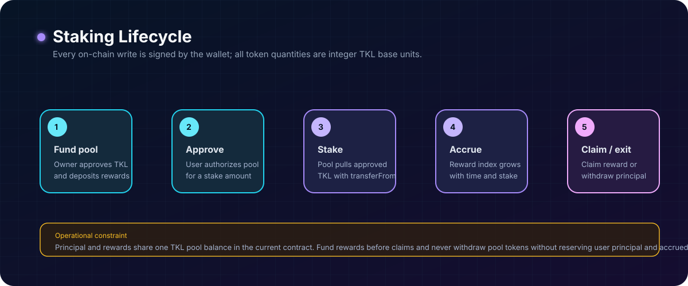

# Domain Model and Invariants

## Overview

TokenLocal contains two on-chain domains:

1. `TokenLocal`, a fungible ERC-20 token represented in integer base units.
2. `StakingContract`, a pool that accepts TKL as principal and distributes TKL rewards over time.

The blockchain is the canonical source of contract state. The React application reads it through ethers and must never be treated as the authority for balances, permissions, allowance, or reward eligibility.

## Relationship model

```text
TokenLocal ERC-20
  ├─ balances[address]
  ├─ allowances[owner][spender]
  └─ owner ────────────────► controls minting

StakingContract
  ├─ stakingToken ─────────► TokenLocal address
  ├─ rewardToken ──────────► TokenLocal address
  ├─ stakes[user] ─────────► staked principal
  ├─ rewards[user] ────────► checkpointed reward credit
  └─ owner ────────────────► configures rate and moves pool tokens
```

The deployed implementation deliberately uses the same TKL contract for both `stakingToken` and `rewardToken`. This means principal and rewards occupy the same ERC-20 balance at the staking contract address.

## Units and decimals

All Solidity quantities are unsigned integers. The token uses OpenZeppelin’s default `18` decimals.

```text
1 TKL = 1 × 10^18 base units
0.1 TKL = 100000000000000000 base units
```

The deploy script turns display values into base units through `ethers.parseUnits`. The frontend uses `ethers.parseUnits` before writes and `ethers.formatUnits` for reads.

Invariant: contract calls must use integer base units; decimal strings are a frontend input format, not an on-chain type.

## TokenLocal entity model

### Token metadata

| Value | Source | Meaning |
| --- | --- | --- |
| `name` | ERC-20 constructor | Human-readable token name. |
| `symbol` | ERC-20 constructor | Short ticker. |
| `decimals` | OpenZeppelin ERC-20 | Number of display decimal places; defaults to 18. |
| `totalSupply` | ERC-20 state | Current sum of all token balances. |
| `owner` | Ownable state | Address authorized to mint and administer ownership. |

The local deployment script sets name `Token Local`, symbol `TKL`, and an initial supply of 1,000,000 display units.

### Balances and transfers

| State / method | Meaning |
| --- | --- |
| `balanceOf(account)` | TKL balance owned by an address. |
| `transfer(to, amount)` | Moves TKL from caller to `to`. |
| `approve(spender, amount)` | Sets the spender’s allowance from caller. |
| `allowance(owner, spender)` | Remaining amount a spender may pull. |
| `transferFrom(from, to, amount)` | Moves approved TKL on behalf of `from`. |

Transfer invariant: total token supply does not change during `transfer`, `approve`, or `transferFrom`. Only minting changes total supply in the supplied token contract.

### Mint authority

`mint(to, amount)` is restricted by `onlyOwner`.

Invariant: a non-owner must never be able to mint. Conversely, the owner can mint without a supply cap in the current implementation. This is a deliberate trust assumption, not a decentralized supply policy.

## Staking state model



| State | Meaning |
| --- | --- |
| `totalStaked` | Sum of principal attributed to all users. |
| `stakes[user]` | Principal currently attributed to one user. |
| `rewardRate` | Emission rate for the current period, in base units per second. Zero until a period is funded. |
| `periodFinish` | Timestamp at which the current reward period ends. |
| `lastRewardTime` | Timestamp of the most recent global reward checkpoint. Never exceeds `periodFinish`. |
| `rewardPerTokenStored` | Global accumulated reward index, scaled by `1e18`. |
| `userRewardPerTokenPaid[user]` | User’s previously accounted global index. |
| `rewards[user]` | Reward checkpointed for later payment. |
| `rewardReserve` | Unpaid reward budget. Bonded alongside `totalStaked`. |
| `totalScheduled` | Lifetime sum of scheduled emission, bounded so the reward index cannot overflow. |

### Stake lifecycle

```text
wallet TKL balance
  │
  │ approve(stakingContract, amount)
  ▼
allowance is granted
  │
  │ stake(amount)
  ▼
TKL is transferred into the pool
stakes[user] and totalStaked increase
  │
  ├─ withdraw(amount) ─► principal returned to user
  └─ claimReward() ────► accrued reward transferred to user
```

The frontend follows this lifecycle: approve first, wait for confirmation, then stake. Approval is an ERC-20 permission and does not transfer tokens by itself.

### Reward formula

When there is at least one staked token:

```text
applicable = min(block.timestamp, periodFinish)

currentRewardPerToken = rewardPerTokenStored
  + (applicable - lastRewardTime) × rewardRate × 1e18 / totalStaked
```

For an individual staker:

```text
earned(user) = stakes[user]
  × (currentRewardPerToken - userRewardPerTokenPaid[user]) / 1e18
  + rewards[user]
```

The `updateReward(account)` modifier checkpoints this accounting before a stake, withdrawal, claim, period funding, or surplus withdrawal.

Reward invariants:

1. When `totalStaked` is zero, no new per-token reward index is accrued. That emission was earned by nobody, so its budget is released from `rewardReserve` back to free balance rather than handed to whoever stakes next.
2. Reward allocation is proportional to stake over the periods represented by each checkpoint.
3. Accrual never runs past `periodFinish`. A new period cannot start while the current one is active, so a rate in flight is never redirected.
4. Emission is bounded by funds already transferred in: `rewardRate × duration` is committed at funding time, and the division remainder is not promised.
5. `contract balance >= totalStaked + rewardReserve` is enforced, so a reward credit is backed rather than merely recorded.

## Access model

| Operation | Authorized caller |
| --- | --- |
| Transfer own TKL | Any token holder with sufficient balance. |
| Stake | Any holder with sufficient allowance and balance. |
| Withdraw stake | User whose `stakes[user]` covers the amount. |
| Claim reward | Any staker; payment requires sufficient reserve and non-principal balance. |
| Mint TKL | Token owner only. |
| Fund a reward period | Staking-contract owner only, after token approval, and only when no period is running. |
| Withdraw pool TKL | Staking-contract owner only, and only up to `freeBalance()`. |
| Transfer staking ownership | Current owner proposes; the named account must accept. |
| Renounce staking ownership | Nobody. The call always reverts. |

The token owner and staking owner are independent ownership fields, although a normal local deployment creates both from the same deployer account.

## Events as audit signals

| Event | State transition signalled |
| --- | --- |
| `Transfer` | Token move, mint, or burn according to ERC-20 conventions. |
| `Approval` | Allowance update. |
| `Staked` | User principal entered the staking pool. |
| `Withdrawn` | User principal left the staking pool. |
| `RewardPaid` | A reward transfer succeeded. |
| `RewardPeriodFunded` | A reward period was funded and started. |
| `ReserveReleased` | Budget for an interval with no stakers returned to free balance. |
| `ExcessWithdrawn` | Owner withdrew free balance. |
| `OwnershipTransferStarted` | An ownership transfer was proposed and awaits acceptance. |
| `OwnershipTransferred` | Contract administration changed. |

Events are useful for indexers, logs, and UI refreshes, but contract storage remains authoritative.

## Critical invariants for future work

1. Preserve TKL base-unit precision; never use JavaScript floating-point values as on-chain quantities.
2. Require ERC-20 approval before calling `stake`.
3. Do not allow a withdrawal larger than `stakes[msg.sender]`.
4. Keep `totalStaked` consistent with accepted stake minus successful withdrawals.
5. Checkpoint rewards before changing a user stake or starting a reward period.
6. Keep `contract balance >= totalStaked + rewardReserve` true after every operation. This is what makes an accrued reward backed rather than merely recorded.
7. Release budget for staker-free intervals using the same `min(block.timestamp, periodFinish)` clamp as accrual. Releasing against a raw timestamp would free time that was never scheduled and leave the reserve short.
8. Never use local Hardhat accounts, addresses, or `contract-info.json` values as public-network deployment data.
9. Keep owner permissions explicit, tested, observable, and documented.
10. Do not let an accounting fault revert inside `updateReward`. Every user function depends on that modifier, so a revert there would lock principal in, not just block the fault.
